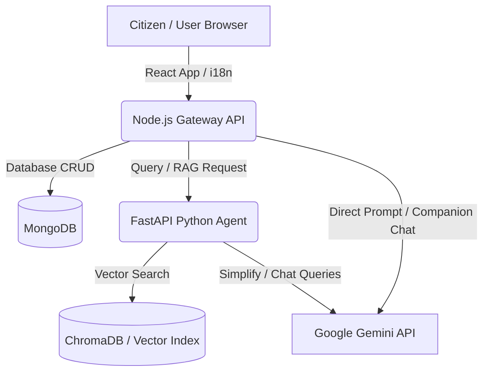

# Implementation Plan - GenAI-powered Civic Platform

This document outlines the architecture, data schemas, development phases, and technical requirements to implement the GenAI-powered Civic Platform.

## 1. System Architecture

The platform consists of a **React Frontend**, a **Node.js Gateway API**, and a **Python RAG/AI pipeline** to handle document analysis and contextual semantic search.

---

## 2. Key Modules & Technology Stack

### Frontend: React (Vite, TypeScript, TailwindCSS/Vanilla CSS)
* **AI Companion Dialog**: Floating chat bubble accessible from any page. Uses speech-to-text / text-to-speech APIs for digital inclusion.
* **Public Issue Reporter**: Form to report complaints (e.g., potholes, street lights) with geo-location inputs and status tracking.
* **Civic Services Directory**: Dashboard to search and filter local services.
* **Multilingual Toggle**: Integration of `react-i18next` for seamless switching of dialects.

### Backend Gateway: Node.js (Express, TypeScript)
* **Authentication**: Session-based anonymous and authenticated login.
* **Complaint Tracking**: REST API to store, update, and retrieve civic complaints.
* **Orchestration Layer**: Communicates with the Python AI service for semantic document search and routes companion chat logs to Gemini.

### Python RAG Service: FastAPI, Pytest, LangChain
* **RAG Pipeline**: Vectorizes municipal codes, service descriptions, and policy documents using Gemini Embeddings and loads them into a vector store (e.g. ChromaDB or FAISS).
* **Document Simplification Engine**: Reads PDF/text files of complex policies and returns simplified summaries, checklists, and required documents.

---

## 3. Database Schema (MongoDB Collections)

### `users` collection
* `_id` (ObjectId, Primary Key)
* `email` (String, Optional)
* `phone` (String, Optional)
* `preferredLanguage` (String, Default: "en")
* `createdAt` (Date)

### `complaints` collection
* `_id` (ObjectId, Primary Key)
* `citizenId` (ObjectId, Ref: users)
* `title` (String)
* `description` (String)
* `category` (String) - e.g., Sanitation, Infrastructure, Utilities
* `location` (Object: { latitude: Double, longitude: Double })
* `status` (String: Pending | In Progress | Resolved)
* `updates` (Array of Objects: { status: String, updatedAt: Date, note: String })
* `createdAt` (Date)

---

## 4. Development Phases & Checklist

### Phase 1: Repository Setup & Backend Skeletons
- [ ] Initialize workspace layout (`/frontend`, `/backend`, `/ai-service`).
- [ ] Set up linting, formatting, and standard configurations.
- [ ] Implement Express routing shell and basic API mock tests.
- [ ] Initialize FastAPI Python framework and test suite environment.

### Phase 2: AI Core & RAG Pipeline (Python)
- [ ] Set up document ingestion script to parse local policy PDFs.
- [ ] Build vector store integration using ChromaDB and Gemini embeddings.
- [ ] Create API endpoint for semantic query search & service recommendations.
- [ ] Add unit tests for document chunking and mocked LLM calls.

### Phase 3: Gateway Orchestration & Database (Node.js)
- [ ] Connect Node.js backend to MongoDB database (e.g. Mongoose or MongoDB Node driver).
- [ ] Build the complaints management CRUD endpoints.
- [ ] Connect the Express server to the Python RAG API.
- [ ] Create the core `/api/chat` route handling contextual companion queries.

### Phase 4: Frontend Development (React)
- [ ] Initialize React Vite app with TypeScript.
- [ ] Design accessible CSS layout focusing on mobile-first responsiveness.
- [ ] Develop the floating **AI Companion Chat Window** with typing indicators.
- [ ] Build **Public Issue reporting form** and status tracking pages.
- [ ] Wire up translation files (e.g. Hindi, Spanish, English) using `react-i18next`.

### Phase 5: Testing, Validation & Refinement
- [ ] Conduct automated frontend tests using Vitest & React Testing Library.
- [ ] Perform backend integration testing (supertest).
- [ ] Verify accessibility compliance (Lighthouse / Screen Reader testing).
- [ ] Validate Gemini API error conditions and rate limit safety guards.

---

## 5. Verification Plan

### Automated Tests
* **Frontend**: `npm run test` (Vitest unit and component rendering checks).
* **Backend Gateway**: `npm run test` (Jest/Supertest integration verification).
* **AI Service**: `pytest` (Verifies FastAPI routes and semantic search return schemas).

### Manual Verification
1. Open the UI, toggle between languages, and verify layout remains intact.
2. Submit a complaint report, locate it in the DB, and track its status change.
3. Upload a complex policy text into the AI companion and check if it yields simplified, bulleted requirements.
